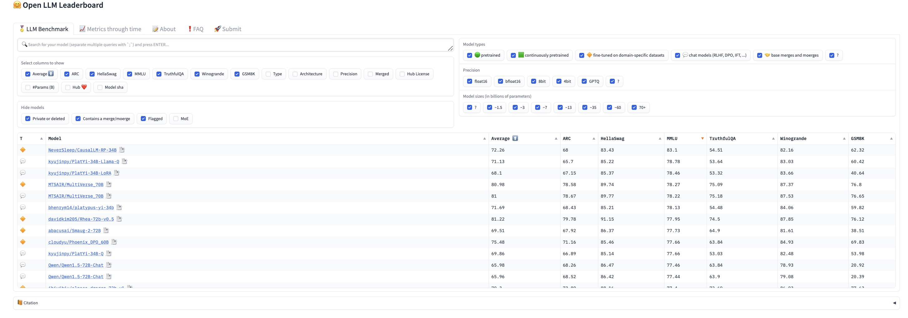

This repository compiles cutting-edge news/post/discussion for Large Language Models (LLMs).

### gpt-5 
[gpt-5, under testing](https://m.36kr.com/p/2720106835687557). longer token, strong inference ability, multi-modal etc. Q- what if gpt-5 had the capability to read scientific papers, find evidence, formulate hypotheses, and sustain inference? => closed loop of how we do research 

### model leaderboard

### next-gen transformer
[mamba](https://huggingface.co/ai21labs/Jamba-v0.1) much longer tokens

### prompt-gen
[cancer patient dialog](https://chat.openai.com/share/ef43a0b6-2d05-4c93-bba9-52ce70e8aecb) 
[llm role generator](https://huggingface.co/spaces/chenhaodev/LLM-Role-Gen-V1)

### llm tech roadmap
[fundmental](https://github.com/mlabonne/llm-course/blob/main/README.md)
[tiny llm, continued-pretraining](https://lightning.ai/lightning-ai/studios/continued-pretraining-with-tinyllama-1-1b)
[rag roadmap](https://twitter.com/RLanceMartin/status/1776301631652741167/photo/1)

### best 34b model but superslow demo
[CausalLM-RP-34B](https://huggingface.co/spaces/chenhaodev/LLM-34B-GGUF-Chat-V2)

### main challenges
* intake: patient-facing function requires high accuracy and security level. multiple components might be required, e.g., speech-to-text, text-to-speech modules [audio2text, whisper](https://huggingface.co/spaces/hf-audio/whisper-large-v3)
* routing patient: multi-agent, or special foundation knowledge
* decision support: multi-agent + prompts + api. (reliable api for drug, emr etc) 
